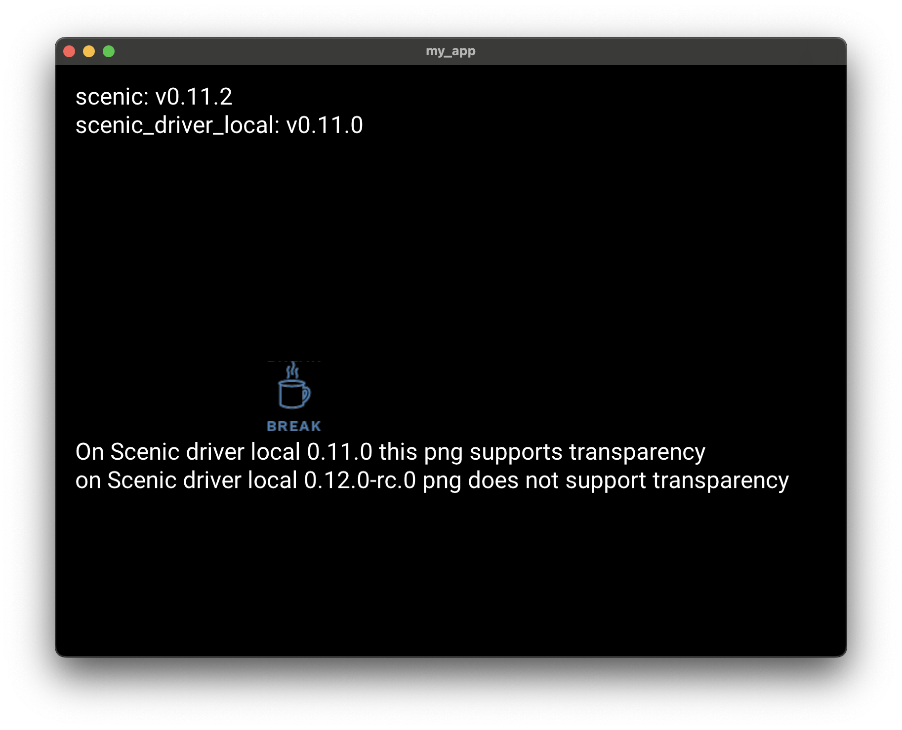
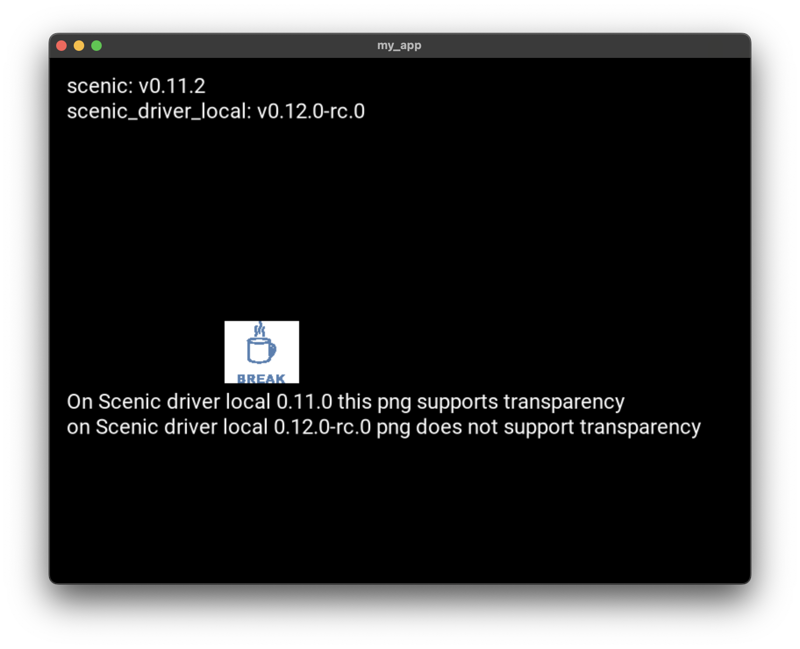

Repro of transparent png support breaking in scenic_driver_local 0.12.0-rc.0

| scenic_driver_local 0.11.2 (working) | scenic_driver_local 0.12.0-rc.0 (broken) |
| ---------- | ------ |
|  |  |

To reproduce run:
- `mix deps.get`
- `iex -S mix`
